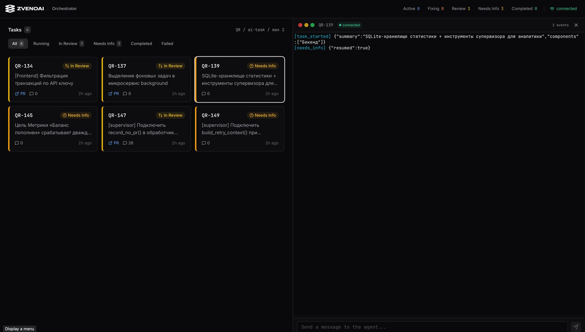
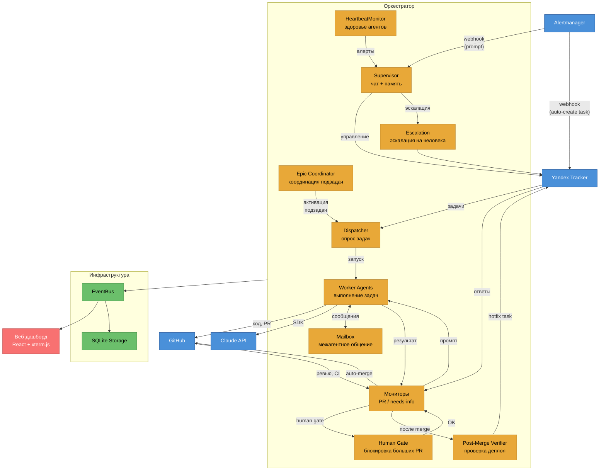
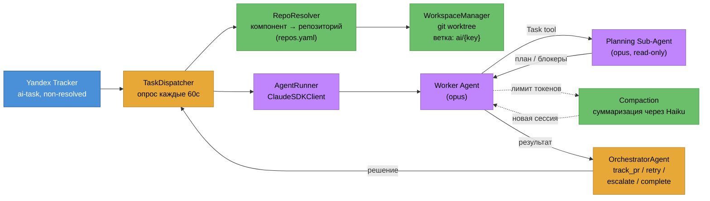
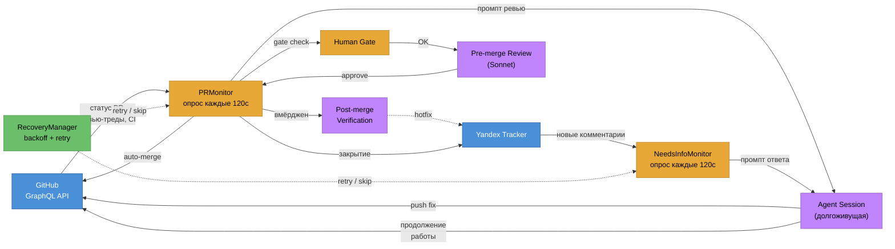
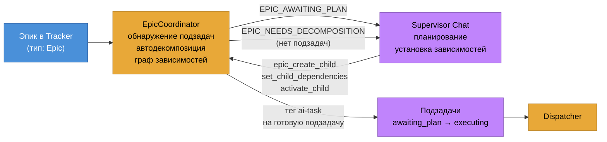
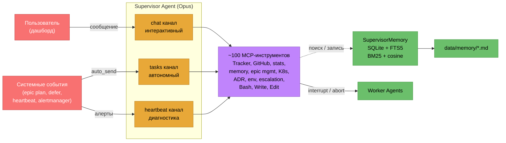
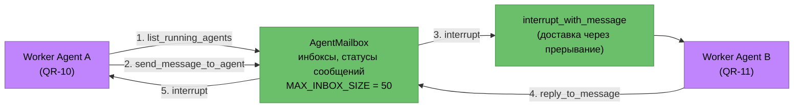
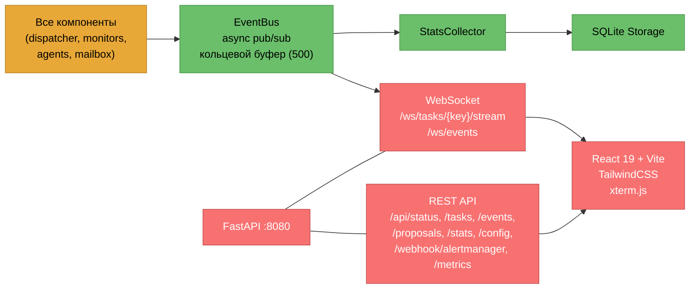
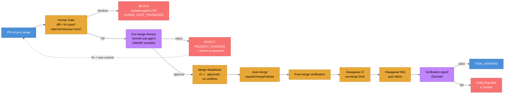
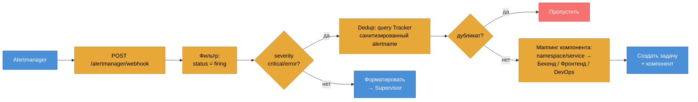

# ZvenoAI Coder

[English version](README_EN.md)

Мы активно используем Coder больше месяца в продакшне — сейчас он пишет ~90% всего кода в [ZvenoAI](https://zveno.ai).



Асинхронный оркестратор на Python: опрашивает Yandex Tracker на задачи с тегом `ai-task`, запускает агентов Claude для их выполнения, координирует подзадачи эпиков по зависимостям (с автодекомпозицией), мониторит PR на ревью-комментарии, автоматически мёржит PR (с human gate и pre-merge code review), верифицирует деплой после merge, принимает алерты из Alertmanager и стримит вывод в веб-дашборд реального времени. Supervisor проактивно мониторит здоровье агентов через heartbeat и может эскалировать на человека.

## Доступ к Claude API из России

Claude API недоступен напрямую из РФ, а оплата зарубежных API-сервисов затруднена. [ZvenoAI](https://zveno.ai) решает обе проблемы:

- **Единый API** (`api.zveno.ai/v1`) — полностью совместим с OpenAI SDK и Claude Agent SDK
- **Оплата в рублях** — карты, СБП, безнал для юрлиц
- **200+ моделей** — OpenAI, Anthropic, Google, xAI и другие через один ключ
- **Автоматический failover** между провайдерами

Для работы Coder достаточно получить API-ключ на [zveno.ai](https://zveno.ai) и указать его в `.env`:

```bash
ANTHROPIC_API_KEY=sk-zveno-...   # ключ ZvenoAI
```

API ZvenoAI совместим с Anthropic SDK — никаких изменений в коде не требуется.

## Как это работает

**Жизненный цикл:** опрос трекера → если задача — эпик: регистрация и координация подзадач через OrchestratorAgent → иначе: разрешение репозиториев → создание worktree → запуск агента (opus) → **планирование (opus sub-agent, read-only)** → если есть блокеры: запрос информации и остановка, иначе: TDD (сначала тесты, потом реализация) → push и создание PR (если нужен) → мониторинг ревью → агент правит комментарии → **human gate** (блокировка больших/чувствительных PR) → **pre-merge code review** (Sonnet sub-agent) → auto-merge → **post-merge verification** (проверка деплоя) → закрытие задачи в трекере. При рестарте оркестратора сессии агентов возобновляются с полным контекстом через `session_id` + `fork_session`.

Агент сам решает, когда задача завершена. PR создаётся только при наличии изменений кода — исследовательские и документационные задачи завершаются без PR.

## Архитектура



## Архитектура (компоненты)

| Компонент | Назначение |
|---|---|
| `orchestrator/main.py` | Асинхронный цикл оркестратора, диспетчеризация задач, мониторинг ревью/needs-info, веб-сервер |
| `orchestrator/config.py` | Конфигурация из переменных окружения с полями SDK |
| `orchestrator/constants.py` | Общие перечисления и типы (EventType, PRState, MAX_COMPACTION_CYCLES) |
| `orchestrator/orchestrator_agent.py` | Обработка результатов — track_pr / retry / escalate / fail / complete, координация эпиков |
| `orchestrator/orchestrator_tools.py` | Реализация терминальных действий (track_pr, retry, escalate, fail, complete) |
| `orchestrator/epic_coordinator.py` | Хранилище состояния подзадач эпика, автодекомпозиция, управление готовностью, активация с учётом зависимостей |
| `orchestrator/agent_runner.py` | Обёртка над Claude Agent SDK, долгоживущие сессии для циклов ревью, захват и возобновление `session_id` после рестарта |
| `orchestrator/compaction.py` | Авто-компактификация контекста: `should_compact()`, `summarize_output()`, `build_continuation_prompt()` |
| `orchestrator/task_dispatcher.py` | Опрос Tracker, запуск агентов с контролем параллелизма через семафор, возобновление сессий после рестарта (`resume` + `fork_session`) |
| `orchestrator/tracker_client.py` | REST-клиент для Yandex Tracker API |
| `orchestrator/tracker_enums.py` | Перечисления и хелперы для сопоставления статусов Tracker |
| `orchestrator/tracker_types.py` | TypedDict-определения типов для ответов Tracker API |
| `orchestrator/tracker_tools.py` | In-process MCP-инструменты, scoped по задаче (без sidecar-процессов) |
| `orchestrator/heartbeat.py` | Периодический мониторинг здоровья агентов (stuck, long-running, stale review), алертинг supervisor с cooldown |
| `orchestrator/github_client.py` | GitHub GraphQL-клиент для ревью-тредов, CI, auto-merge (enablePullRequestAutoMerge), проверки готовности к мёржу |
| `orchestrator/pr_monitor.py` | Цикл мониторинга PR ревью/CI + human gate + pre-merge review + auto-merge + post-merge verification trigger |
| `orchestrator/pre_merge_reviewer.py` | One-shot sub-agent (Sonnet) для code review перед auto-merge: OWASP checklist, fail-close по умолчанию |
| `orchestrator/post_merge_verifier.py` | Верификация деплоя после merge: ожидание CI на merge SHA, K8s rollout, sub-agent проверки, авто-создание hotfix |
| `orchestrator/alertmanager_webhook.py` | Парсинг Alertmanager webhook, дедупликация, маппинг компонентов, авто-создание задач в Tracker |
| `orchestrator/adr.py` | Architecture Decision Records: создание/список/чтение markdown-файлов в `docs/decisions/` |
| `orchestrator/escalation.py` | Эскалация supervisor → человек: тег `needs-human-review` + структурированный комментарий в Tracker |
| `orchestrator/dependency_manager.py` | Автодефер задач с неразрешёнными зависимостями (Tracker links + LLM-экстракция блокеров), рекурентная перепроверка |
| `orchestrator/k8s_client.py` | Kubernetes client: pod logs/status через in-cluster ServiceAccount, feature-gated (`K8S_LOGS_ENABLED`) |
| `orchestrator/metrics.py` | Prometheus-метрики (Counter, Gauge, Histogram) для VictoriaMetrics, endpoint `/metrics` |
| `orchestrator/preflight_checker.py` | Preflight-проверки задач перед запуском агента |
| `orchestrator/llm_utils.py` | Общие утилиты для LLM-вызовов (Haiku) |
| `orchestrator/needs_info_monitor.py` | Мониторинг статуса needs-info — ожидание ответов от людей |
| `orchestrator/agent_mailbox.py` | Межагентный почтовый ящик — маршрутизация сообщений, управление inbox, interrupt-доставка |
| `orchestrator/comm_tools.py` | MCP-инструменты для общения worker-агентов (list peers, send/reply/check messages) |
| `orchestrator/supervisor.py` | Инициализация SupervisorRunner (memory index, embedder) |
| `orchestrator/supervisor_chat.py` | Интерактивный стриминг-чат с supervisor-агентом |
| `orchestrator/supervisor_tools.py` | Supervisor MCP-инструменты — Tracker, GitHub, статистика, память, управление агентами, ADR, env config |
| `orchestrator/supervisor_prompt_builder.py` | Построение системного промпта для supervisor |
| `orchestrator/supervisor_memory.py` | SQLite + FTS5 гибридный поиск по markdown-файлам (`data/memory/`) |
| `orchestrator/prompt_builder.py` | Построение промптов задач для worker-агентов |
| `orchestrator/repo_resolver.py` | Клонирование/pull git-репозиториев из `repos.yaml`, блокировки по репо |
| `orchestrator/workspace.py` | Создание/очистка git worktree на задачу, блокировки по репо |
| `orchestrator/workspace_tools.py` | MCP-инструменты для workspace (ленивое создание worktree) |
| `orchestrator/recovery.py` | Персистенция состояния восстановления, классификация ошибок, отслеживание backoff |
| `orchestrator/proposal_manager.py` | Жизненный цикл предложений по улучшению |
| `orchestrator/event_bus.py` | Async pub/sub с кольцевым буфером истории на задачу |
| `orchestrator/stats_collector.py` | Подписчик EventBus, записывающий статистику в хранилище |
| `orchestrator/stats_models.py` | Модели данных для персистентной статистики (TaskRun, SupervisorRun и т.д.) |
| `orchestrator/storage.py` | Абстрактный Storage Protocol для бекендов персистенции |
| `orchestrator/sqlite_storage.py` | Реализация хранилища на SQLite |
| `orchestrator/_persistence.py` | Mixin для фоновой персистенции через asyncio-задачи |
| `orchestrator/web.py` | FastAPI REST + WebSocket + Alertmanager webhook + Prometheus /metrics, раздача React-фронтенда |
| `frontend/` | React 19 + Vite + TypeScript + xterm.js терминал |

## Быстрый старт

```bash
cp .env.example .env
# Заполнить: YANDEX_TRACKER_TOKEN, YANDEX_TRACKER_ORG_ID, CLAUDE_CODE_OAUTH_TOKEN или ANTHROPIC_API_KEY, GITHUB_TOKEN

docker compose up -d
# Дашборд: http://localhost:8080
```

## Деплой

### Требования

- **Yandex Tracker** — организация с очередью задач
- **GitHub** — токен с правами на целевые репозитории (`repo` scope)
- **Claude API** — OAuth-токен Claude Code или API-ключ (Anthropic / ZvenoAI)
- **Docker** — для локального деплоя через Docker Compose
- **Kubernetes** — для production-деплоя через Helm

### Docker Compose (локальный / dev)

```bash
cp .env.example .env
# Заполнить обязательные переменные (см. раздел Аутентификация)

docker compose up -d          # запуск
docker compose logs -f        # логи
docker compose up -d --build  # пересборка после изменений
```

**Что внутри:**

| Volume | Путь в контейнере | Назначение |
|---|---|---|
| `workspace` | `/workspace` | Клонированные репозитории и git worktree агентов |
| `stats-data` | `/app/data` | SQLite БД (статистика, состояние задач, PR lifecycle) |
| `./prompts` | `/app/prompts` (ro) | Промпты агентов — монтируются read-only для быстрой правки без пересборки |
| Docker socket | `/var/run/docker.sock` | Агенты используют Docker CLI внутри worktree (`make gen`, `docker compose up`, testcontainers) |

> **Docker socket** монтируется потому что агенты запускают команды сборки и тесты в целевых репозиториях. Если целевые проекты не используют Docker — можно убрать из `docker-compose.yaml`.

**Порты:**
- `8080` — веб-дашборд (REST API + WebSocket + Prometheus `/metrics`)

### Kubernetes (production)

В каталоге [`helm/`](https://github.com/zvenoai/coder) лежит Helm chart. Пример деплоя:

```bash
helm install coder ./helm/charts/coder \
  -f helm/values/dev/coder.yaml \
  --set externalSecrets.enabled=true
```

**Ключевые особенности chart'а:**

- **ExternalSecrets** — секреты (Tracker token, GitHub token, API key) загружаются из Vault через `ExternalSecret` CRD. Fallback на Kubernetes Secret если `externalSecrets.enabled=false`.
- **Persistent storage** — два PVC: `workspace` (20Gi, для репозиториев) и `stats-data` (1Gi, SQLite).
- **RBAC** — `rbac.create=true` создаёт Role/RoleBinding для чтения pod logs (нужно для `K8S_LOGS_ENABLED=true`).
- **Docker-in-Docker** — опциональный sidecar (`dind.enabled=true`) для агентов, использующих Docker CLI внутри worktree.
- **HTTPRoute** — опциональный Gateway API route (`route.enabled=true`) для доступа к дашборду.
- **Recreate strategy** — один реплика, Recreate (не Rolling) из-за SQLite и git worktree.
- **Graceful shutdown** — `terminationGracePeriodSeconds: 120` для завершения активных агентов.
- **Reloader** — аннотация `reloader.stakater.com/auto: "true"` для авто-рестарта при изменении ConfigMap/Secret.

**Структура values:**

```
helm/
  charts/coder/          # chart и шаблоны
    values.yaml          # дефолты (пустые секреты, минимальные ресурсы)
  values/
    dev/coder.yaml       # dev-окружение (ваши значения)
    prod/coder.yaml      # production
```

**Минимальные ресурсы:**

| Контейнер | Requests | Limits |
|---|---|---|
| coder | 400m CPU, 4Gi RAM | 2000m CPU, 8Gi RAM |
| dind (опционально) | 400m CPU, 2Gi RAM | 2000m CPU, 4Gi RAM |

> RAM зависит от `MAX_CONCURRENT_AGENTS`. Каждый агент — это процесс Claude Code CLI (~500MB-1GB RAM). Для 10 параллельных агентов рекомендуется 8-16Gi.

## Аутентификация

Оркестратор передаёт учётные данные в Claude Agent SDK. Три варианта (по приоритету):

| Переменная окружения | Описание | Приоритет |
|---|---|---|
| `CLAUDE_CODE_OAUTH_TOKEN` | Квота подписки Claude Code | 1 (предпочтительный) |
| `ANTHROPIC_API_KEY` | API-ключ Anthropic или [ZvenoAI](https://zveno.ai) | 2 |

### Вариант 1 — через ZvenoAI (рекомендуется для РФ)

Зарегистрируйтесь на [zveno.ai](https://zveno.ai), получите API-ключ и укажите в `.env`:

```bash
ANTHROPIC_API_KEY=sk-zveno-...
```

Оплата в рублях, без VPN и зарубежных карт.

### Вариант 2 — через OAuth-токен Claude Code

Claude Code CLI сохраняет OAuth-токены в системное хранилище ключей после авторизации.

**Авторизация через CLI** (токен сохраняется автоматически):
```bash
claude
# в REPL ввести: /login
# завершить OAuth в браузере
```

**Извлечение существующего токена из macOS Keychain:**
```bash
security find-generic-password -s "Claude Code-credentials" -w \
  | python3 -c "import sys,json; print(json.load(sys.stdin)['claudeAiOauth']['accessToken'])"
```

Формат токена: `sk-ant-oat01-...`. Задаётся в `.env` или Vault.

### Вариант 3 — напрямую через Anthropic API

Если у вас есть прямой доступ к Anthropic API:

```bash
ANTHROPIC_API_KEY=sk-ant-...
```

## Конфигурация

Все параметры через переменные окружения (см. `.env.example`):

| Переменная | Значение по умолчанию | Описание |
|---|---|---|
| `TRACKER_QUEUE` | `QR` | Ключ очереди в Yandex Tracker |
| `TRACKER_TAG` | `ai-task` | Тег, запускающий диспетчеризацию агента |
| `AGENT_MODEL` | `claude-opus-4-6` | Модель Claude для worker-агентов |
| `AGENT_MAX_BUDGET_USD` | _(нет)_ | Лимит расходов на задачу (опционально) |
| `MAX_CONCURRENT_AGENTS` | `2` | Лимит параллельных агентов |
| `AGENT_PERMISSION_MODE` | `acceptEdits` | Режим прав SDK |
| `REVIEW_CHECK_DELAY_SECONDS` | `120` | Интервал опроса PR-ревью |
| `SUPERVISOR_MODEL` | `claude-opus-4-6` | Модель для supervisor-чата |
| `COMPACTION_ENABLED` | `true` | Включить авто-компактификацию контекста |
| `COMPACTION_BUFFER_TOKENS` | `20000` | Буфер до лимита контекста для срабатывания компактификации |
| `COMPACTION_MODEL` | `claude-haiku-4-5-20251001` | Модель для суммаризации при компактификации |
| `AUTO_MERGE_ENABLED` | `false` | Включить авто-мёрж PR (opt-in) |
| `AUTO_MERGE_METHOD` | `squash` | Метод мёржа (squash, merge, rebase) |
| `AUTO_MERGE_REQUIRE_APPROVAL` | `true` | Требовать approval перед авто-мёржем |
| `PRE_MERGE_REVIEW_ENABLED` | `false` | Включить code review sub-agent перед merge |
| `PRE_MERGE_REVIEW_FAIL_OPEN` | `false` | При ошибке/таймауте: `false` = reject, `true` = approve |
| `HUMAN_GATE_MAX_DIFF_LINES` | `0` | Порог diff для блокировки auto-merge (0 = выключен) |
| `HUMAN_GATE_SENSITIVE_PATHS` | _(пусто)_ | Comma-separated glob-паттерны чувствительных файлов |
| `POST_MERGE_VERIFICATION_ENABLED` | `false` | Включить верификацию деплоя после merge |
| `POST_MERGE_VERIFICATION_ENVIRONMENT` | `dev` | Окружение для верификации |
| `ALERTMANAGER_WEBHOOK_ENABLED` | `false` | Включить приём алертов из Alertmanager |
| `ALERTMANAGER_AUTO_CREATE_TASK` | `false` | Авто-создание задач из critical/error алертов |
| `HEARTBEAT_INTERVAL_SECONDS` | `300` | Интервал проверки здоровья агентов |

## Маппинг репозиториев

`repos.yaml` перечисляет git-репозитории, клонируемые в workspace:

```yaml
all_repos:
  - url: https://github.com/org/api.git
    path: /workspace/api
    description: "Go API backend"
  - url: https://github.com/org/frontend.git
    path: /workspace/frontend
    description: "Next.js frontend"
```

## Разработка

```bash
python3 -m venv .venv && source .venv/bin/activate
pip install -e ".[dev]"
pytest tests/ -v
```

Проверка качества (Docker, синхронизировано с CI):
```bash
task quality          # все проверки (Python + Frontend параллельно)
task python:quality   # lint → format:check → typecheck → test
task frontend:quality # typecheck → lint → test → build
```

Фронтенд:
```bash
cd frontend && npm install && npm run dev
```

## Контейнерный тулчейн

Docker-образ содержит: Python 3.12, Node.js 22, Go 1.24, Docker CLI, docker-compose, gh CLI, Claude Code CLI. Docker-сокет монтируется для `make gen`, `docker compose up` (тестовая инфра) и testcontainers внутри worktree агентов.

---

## Детальные схемы по модулям

### Диспетчеризация и выполнение задач



### Мониторинг PR и needs-info



### Координация эпиков



### Supervisor

Supervisor — один агент (Opus, `bypassPermissions`), работающий через **три независимых канала** (каждый со своей сессией и историей):

| Канал | Назначение | Триггер |
|---|---|---|
| `chat` | Интерактивный чат с оператором через дашборд | Оператор пишет сообщение |
| `tasks` | Автономные уведомления (эпики, деферы, декомпозиция, алерты) | Системные события (fire-and-forget через `auto_send`) |
| `heartbeat` | Диагностика (застрявшие агенты, долгие задачи, stale ревью) | `HeartbeatMonitor` каждые 5 мин |

Сессия в каждом канале — долгоживущая (не пересоздаётся на каждое сообщение), история накапливается.

#### Инструменты supervisor vs worker

Worker-агенты получают **узкий набор** инструментов, ограниченных контекстом своей задачи. Supervisor — **глобальный доступ** ко всей системе.

| Категория | Worker (4 + 5 comm) | Supervisor (~100 инструментов) |
|---|---|---|
| **Tracker** | Только свой issue (get, comment, checklist) | Поиск, создание, обновление любых задач |
| **GitHub** | Нет | PR diff, reviews, checks, mergeability |
| **Статистика** | Нет | Summary, costs, errors, произвольные SQL |
| **Память** | Нет | CRUD + гибридный поиск (BM25 + vector) |
| **Эпики** | Нет | Планирование зависимостей, активация/ресет детей |
| **Агенты** | Нет | List/abort/cancel агентов, отправка сообщений |
| **Зависимости** | Нет | Approve/defer задач |
| **Межагентное** | send/reply/check/list (свой скоуп) | view_agent_messages, get_comm_stats (read-only) |
| **K8s** | Нет | Pod logs/status (опционально) |
| **ADR** | Нет | Создание/список/чтение Architecture Decision Records |
| **Env config** | Нет | Чтение/запись per-env connection details (API URLs, credentials) |
| **Эскалация** | Нет | Тег `needs-human-review` + комментарий в Tracker |
| **Файловая система** | Workspace (свой worktree) | Bash, Write, Edit (без ограничений) |

#### Взаимодействие с воркерами

- **Supervisor → Worker**: `send_message_to_task()` (interrupt текущей сессии), `abort_task()`, `cancel_task()`
- **Worker → Supervisor**: напрямую невозможно; supervisor видит всё через EventBus и `view_agent_messages`



### Межагентное общение



### Веб-дашборд и события



### Auto-merge pipeline



### Alertmanager webhook


