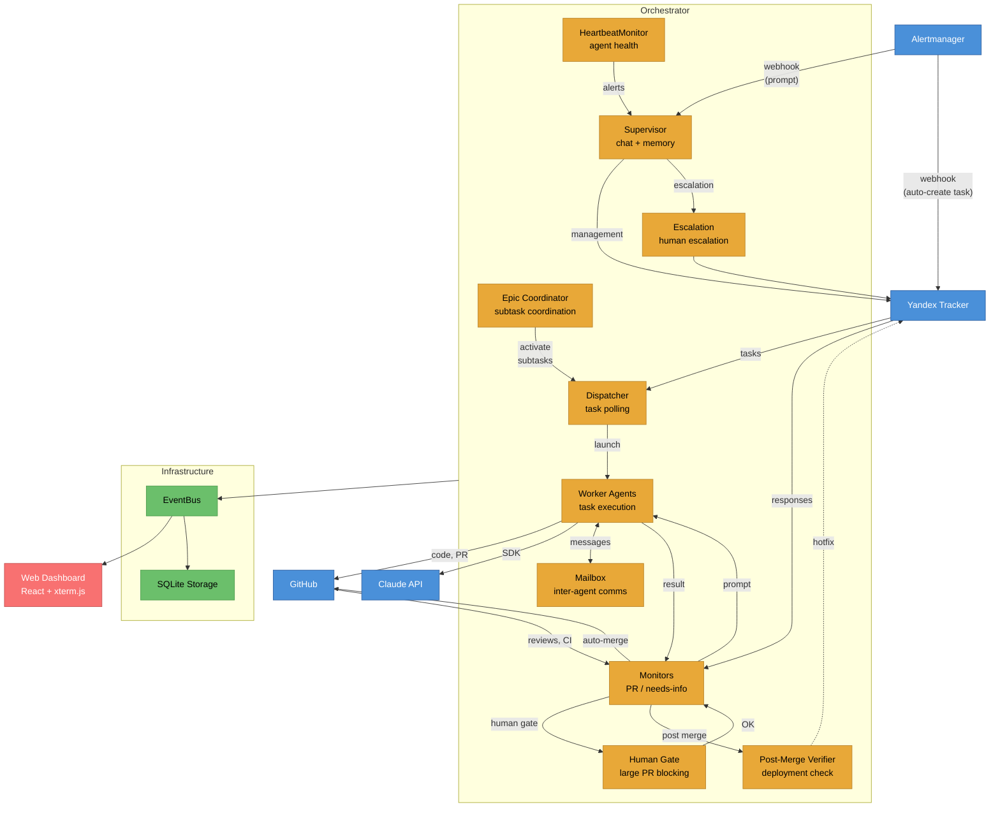

# ZvenoAI Coder

We've been actively using Coder in production for over a month -- it now writes ~90% of all code at [ZvenoAI](https://zveno.ai).


Async Python orchestrator that polls Yandex Tracker for tasks tagged `ai-task`, dispatches Claude Agent SDK agents to execute them, coordinates epic subtasks by dependencies (with auto-decomposition), monitors PRs for review comments, auto-merges PRs (with human gate and pre-merge code review), verifies deployments post-merge, accepts Alertmanager alerts, and streams output to a real-time web dashboard. Supervisor proactively monitors agent health via heartbeat and can escalate to humans.

## How It Works

**Lifecycle:** poll tracker -> if epic: register and coordinate subtasks via OrchestratorAgent -> else: resolve repos -> create worktree -> launch agent (Opus) -> **planning (Opus sub-agent, read-only)** -> if blockers: request info and pause, else: TDD (tests first, then implementation) -> push and create PR (if needed) -> monitor reviews -> agent addresses comments -> **human gate** (blocks large/sensitive PRs) -> **pre-merge code review** (Sonnet sub-agent) -> auto-merge -> **post-merge verification** (deployment check) -> close task in tracker. On orchestrator restart, agent sessions resume with full context via `session_id` + `fork_session`.

The agent decides when the task is done. PRs are created only when code changes are needed -- research and documentation tasks complete without a PR.

## Architecture



## Components

| Component | Purpose |
|---|---|
| `orchestrator/main.py` | Async orchestrator loop, task dispatch, review/needs-info monitoring, web server |
| `orchestrator/config.py` | Environment-based configuration with SDK fields |
| `orchestrator/constants.py` | Shared enums and types (EventType, PRState, MAX_COMPACTION_CYCLES) |
| `orchestrator/orchestrator_agent.py` | Result processing -- track_pr / retry / escalate / fail / complete, epic coordination |
| `orchestrator/orchestrator_tools.py` | Terminal action implementations (track_pr, retry, escalate, fail, complete) |
| `orchestrator/epic_coordinator.py` | Epic subtask state, auto-decomposition, readiness management, dependency-aware activation |
| `orchestrator/agent_runner.py` | Claude Agent SDK wrapper, long-lived sessions for review cycles, session_id capture and resume |
| `orchestrator/compaction.py` | Auto-compaction: `should_compact()`, `summarize_output()`, `build_continuation_prompt()` |
| `orchestrator/task_dispatcher.py` | Tracker polling, agent launch with semaphore concurrency control, session resume after restart |
| `orchestrator/tracker_client.py` | Yandex Tracker REST API client |
| `orchestrator/tracker_tools.py` | In-process MCP tools, scoped per-task (no sidecar processes) |
| `orchestrator/heartbeat.py` | Periodic agent health monitoring (stuck, long-running, stale review), supervisor alerting with cooldown |
| `orchestrator/github_client.py` | GitHub GraphQL client for review threads, CI, auto-merge, merge readiness checks |
| `orchestrator/pr_monitor.py` | PR review/CI monitoring loop + human gate + pre-merge review + auto-merge + post-merge verification trigger |
| `orchestrator/pre_merge_reviewer.py` | One-shot sub-agent (Sonnet) for code review before auto-merge: OWASP checklist, fail-close default |
| `orchestrator/post_merge_verifier.py` | Post-merge deployment verification: CI wait on merge SHA, K8s rollout, verification sub-agent, auto-hotfix |
| `orchestrator/alertmanager_webhook.py` | Alertmanager webhook parsing, dedup, component mapping, auto-task creation in Tracker |
| `orchestrator/dependency_manager.py` | Auto-defer tasks with unresolved dependencies (Tracker links + LLM-based blocker extraction via Haiku) |
| `orchestrator/supervisor.py` | Supervisor memory system initialization (SupervisorRunner, memory_index, embedder) |
| `orchestrator/supervisor_chat.py` | Interactive + autonomous streaming chat with supervisor |
| `orchestrator/supervisor_tools.py` | Supervisor MCP tools -- Tracker, GitHub, stats, memory, agent management, ADR, env config |
| `orchestrator/supervisor_memory.py` | SQLite + FTS5 hybrid search over markdown files (`data/memory/`) |
| `orchestrator/agent_mailbox.py` | Inter-agent communication mailbox -- message routing, inbox management, interrupt-based delivery |
| `orchestrator/comm_tools.py` | MCP tools for worker agent communication (list peers, send/reply/check messages) |
| `orchestrator/event_bus.py` | Async pub/sub with per-task ring buffer history |
| `orchestrator/web.py` | FastAPI REST + WebSocket + Alertmanager webhook + Prometheus /metrics, serves React frontend |
| `frontend/` | React 19 + Vite + TypeScript + xterm.js terminal |

## Quick Start

```bash
cp .env.example .env
# Fill in: YANDEX_TRACKER_TOKEN, YANDEX_TRACKER_ORG_ID, CLAUDE_CODE_OAUTH_TOKEN or ANTHROPIC_API_KEY, GITHUB_TOKEN

docker compose up -d
# Dashboard: http://localhost:8080
```

## Deployment

### Prerequisites

- **Yandex Tracker** -- organization with a task queue
- **GitHub** -- token with access to target repositories (`repo` scope)
- **Claude API** -- Claude Code OAuth token or API key (Anthropic or compatible provider)
- **Docker** -- for local deployment via Docker Compose
- **Kubernetes** -- for production deployment via Helm

### Docker Compose (local / dev)

```bash
cp .env.example .env
# Fill in required variables (see Authentication section)

docker compose up -d          # start
docker compose logs -f        # logs
docker compose up -d --build  # rebuild after changes
```

**What's inside:**

| Volume | Container path | Purpose |
|---|---|---|
| `workspace` | `/workspace` | Cloned repos and agent git worktrees |
| `stats-data` | `/app/data` | SQLite databases (stats, task state, PR lifecycle) |
| `./prompts` | `/app/prompts` (ro) | Agent prompts -- mounted read-only for quick edits without rebuild |
| Docker socket | `/var/run/docker.sock` | Agents use Docker CLI inside worktrees (`make gen`, `docker compose up`, testcontainers) |

> **Docker socket** is mounted because agents run build commands and tests in target repositories. If your target projects don't use Docker, you can remove this from `docker-compose.yaml`.

**Ports:**
- `8080` -- web dashboard (REST API + WebSocket + Prometheus `/metrics`)

### Kubernetes (production)

A Helm chart is provided in the `helm/` directory. Example deployment:

```bash
helm install coder ./helm/charts/coder \
  -f helm/values/dev/coder.yaml \
  --set externalSecrets.enabled=true
```

**Key chart features:**

- **ExternalSecrets** -- secrets (Tracker token, GitHub token, API key) loaded from Vault via `ExternalSecret` CRD. Falls back to Kubernetes Secret when `externalSecrets.enabled=false`.
- **Persistent storage** -- two PVCs: `workspace` (20Gi, for repos) and `stats-data` (1Gi, SQLite).
- **RBAC** -- `rbac.create=true` creates Role/RoleBinding for pod log reading (required for `K8S_LOGS_ENABLED=true`).
- **Docker-in-Docker** -- optional sidecar (`dind.enabled=true`) for agents that use Docker CLI inside worktrees.
- **HTTPRoute** -- optional Gateway API route (`route.enabled=true`) for dashboard access.
- **Recreate strategy** -- single replica, Recreate (not Rolling) due to SQLite and git worktrees.
- **Graceful shutdown** -- `terminationGracePeriodSeconds: 120` to let active agents finish.
- **Reloader** -- `reloader.stakater.com/auto: "true"` annotation for auto-restart on ConfigMap/Secret changes.

**Values structure:**

```
helm/
  charts/coder/          # chart and templates
    values.yaml          # defaults (empty secrets, minimal resources)
  values/
    dev/coder.yaml       # dev environment (your values)
    prod/coder.yaml      # production
```

**Minimum resources:**

| Container | Requests | Limits |
|---|---|---|
| coder | 400m CPU, 4Gi RAM | 2000m CPU, 8Gi RAM |
| dind (optional) | 400m CPU, 2Gi RAM | 2000m CPU, 4Gi RAM |

> RAM depends on `MAX_CONCURRENT_AGENTS`. Each agent is a Claude Code CLI process (~500MB-1GB RAM). For 10 concurrent agents, 8-16Gi is recommended.

## Authentication

The orchestrator passes credentials to the Claude Agent SDK. Two options (by priority):

| Environment Variable | Description | Priority |
|---|---|---|
| `CLAUDE_CODE_OAUTH_TOKEN` | Claude Code subscription quota | 1 (preferred) |
| `ANTHROPIC_API_KEY` | Anthropic API key (or compatible provider) | 2 |

### Option 1 -- Claude Code OAuth Token

Claude Code CLI stores OAuth tokens in the system keychain after authorization.

**Authorize via CLI** (token saved automatically):
```bash
claude
# In REPL: /login
# Complete OAuth in browser
```

**Extract existing token from macOS Keychain:**
```bash
security find-generic-password -s "Claude Code-credentials" -w \
  | python3 -c "import sys,json; print(json.load(sys.stdin)['claudeAiOauth']['accessToken'])"
```

Token format: `sk-ant-oat01-...`. Set in `.env` or your secrets manager.

### Option 2 -- Anthropic API Key

```bash
ANTHROPIC_API_KEY=sk-ant-...
```

## Configuration

All parameters via environment variables (see `.env.example`):

| Variable | Default | Description |
|---|---|---|
| `TRACKER_QUEUE` | `QR` | Yandex Tracker queue key |
| `TRACKER_TAG` | `ai-task` | Tag that triggers agent dispatch |
| `TRACKER_PROJECT_ID` | `0` | Yandex Tracker project ID for task creation |
| `TRACKER_BOARDS` | _(empty)_ | Comma-separated board IDs for task creation |
| `COMPONENT_ASSIGNEE_MAP` | `{}` | JSON: component to [tracker_component, assignee] mapping |
| `AGENT_MODEL` | `claude-opus-4-6` | Claude model for worker agents |
| `AGENT_MAX_BUDGET_USD` | _(none)_ | Per-task cost limit (optional) |
| `MAX_CONCURRENT_AGENTS` | `2` | Parallel agent limit |
| `AGENT_PERMISSION_MODE` | `acceptEdits` | SDK permission mode |
| `REVIEW_CHECK_DELAY_SECONDS` | `120` | PR review polling interval |
| `SUPERVISOR_MODEL` | `claude-opus-4-6` | Supervisor chat model |
| `COMPACTION_ENABLED` | `true` | Enable auto-context compaction |
| `AUTO_MERGE_ENABLED` | `false` | Enable PR auto-merge (opt-in) |
| `AUTO_MERGE_METHOD` | `squash` | Merge method (squash, merge, rebase) |
| `PRE_MERGE_REVIEW_ENABLED` | `false` | Enable code review sub-agent before merge |
| `PRE_MERGE_REVIEW_FAIL_OPEN` | `false` | On error/timeout: `false` = reject, `true` = approve |
| `HUMAN_GATE_MAX_DIFF_LINES` | `0` | Diff threshold to block auto-merge (0 = disabled) |
| `HUMAN_GATE_SENSITIVE_PATHS` | _(empty)_ | Comma-separated glob patterns for sensitive files |
| `POST_MERGE_VERIFICATION_ENABLED` | `false` | Enable post-merge deployment verification |
| `ALERTMANAGER_WEBHOOK_ENABLED` | `false` | Enable Alertmanager webhook ingestion |
| `ALERTMANAGER_AUTO_CREATE_TASK` | `false` | Auto-create tasks from critical/error alerts |
| `HEARTBEAT_INTERVAL_SECONDS` | `300` | Agent health check interval |

## Repository Mapping

Configure repositories via `REPOS_CONFIG` environment variable (JSON array):

```json
[
  {"url": "https://github.com/org/api.git", "path": "/workspace/api", "description": "Go API backend"},
  {"url": "https://github.com/org/frontend.git", "path": "/workspace/frontend", "description": "Next.js frontend"}
]
```

## Development

```bash
python3 -m venv .venv && source .venv/bin/activate
pip install -e ".[dev]"
pytest tests/ -v
```

Quality checks (Docker, synced with CI):
```bash
task quality          # all checks (Python + Frontend in parallel)
task python:quality   # lint -> format:check -> typecheck -> test
task frontend:quality # typecheck -> lint -> test -> build
```

Frontend:
```bash
cd frontend && npm install && npm run dev
```

## Container Toolchain

The Docker image includes: Python 3.12, Node.js 22, Go 1.24, Docker CLI, docker-compose, gh CLI, Claude Code CLI. Docker socket is mounted for `make gen`, `docker compose up` (test infra), and testcontainers inside agent worktrees.

## License

[Apache 2.0](LICENSE)
